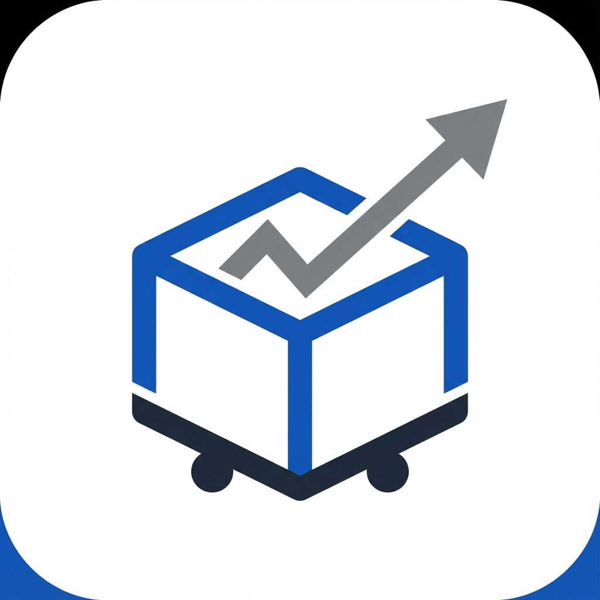

<div align="center">
  
  <h1>YBS - Modern Satınalma Yönetim Sistemi</h1>
  
  <p>
    <strong>Kurumsal Satınalma Süreçleri, Finansal Raporlama ve Yapay Zeka Destekli Tahminleme Platformu</strong>
  </p>

  <p>
    
    
    
    
  </p>
</div>


## 🛠️ Teknolojik Altyapı

Bu proje, yüksek performans ve genişletilebilirlik için modern teknolojilerle geliştirilmiştir:

*   **Dil:** Python 3.11+
*   **Arayüz:** PyQt6 (Modern Widget Tabanlı Mimari)
*   **Veritabanı:** SQLite3 (İlişkisel Veri Modeli - JSON gerektirmez)
*   **Veri Analitiği:** Pandas & NumPy
*   **Görselleştirme:** Matplotlib (Entegre Grafikler)
*   **Yapay Zeka:** Scikit-Learn (Tahminleme Modelleri)

---

## 💻 Kurulum Rehberi

Proje, hem standart `pip` hem de modern `uv` paket yöneticisini destekler.

### Ön Gereksinimler
*   Bilgisayarınızda **Python 3.11** veya daha yeni bir sürümün yüklü olması gerekir.

### Seçenek 1: Standart Kurulum (Önerilen)

1.  **Projeyi İndirin:** Klasörü bilgisayarınıza kopyalayın.
2.  **Terminali Açın:** Proje klasörünün içine girin.
3.  **Gerekli Kütüphaneleri Yükleyin:**
    ```bash
    pip install -r requirements.txt
    ```
4.  **Uygulamayı Başlatın:**
    ```bash
    python main.py
    ```

### Seçenek 2: Modern Kurulum (UV ile Hızlı Kurulum)

Eğer sisteminizde `uv` yüklü ise çok daha hızlı kurulum yapabilirsiniz:

1.  **Bağımlılıkları Yükleyin:**
    ```bash
    uv sync
    ```
2.  **Uygulamayı Başlatın:**
    ```bash
    uv run main.py
    ```

---

## 📂 Proje Yapısı

```
YBS/
├── main.py                # Uygulamanın Başlangıç Noktası
├── requirements.txt       # Kütüphane Listesi (Pip)
├── pyproject.toml         # Proje Konfigürasyonu (Modern)
├── purchasing.db          # Veritabanı Dosyası (Otomatik oluşur)
├── database/              # Veritabanı Bağlantı Kodları
├── forms/                 # Tüm Arayüz (Form) Dosyaları
│   ├── frm_dashboard.py   # Ana Sayfa Grafikleri
│   ├── frm_raporlar.py    # Raporlama Mantığı
│   └── ...
├── utils/                 # Yardımcı Araçlar (Tema, Log, Config)
└── resources/             # İkonlar ve Görseller
```

---

## 📝 Loglar ve Hata Takibi

Uygulama çalışırken yapılan işlemler ve olası hatalar log dosyalarına kaydedilir.

*   **Geliştirme Ortamı (Source Code):** Proje klasörü içindeki `logs` klasöründe bulunur.
*   **Windows Uygulaması (.exe):** Bilgisayarınızın **Belgelerim** klasörü içindeki `YBS_Logs` klasöründe bulunur (`Documents/YBS_Logs`).

---

## ⚠️ Önemli Notlar

*   **İşletim Sistemi Farklılıkları:** Bu proje yapısal olarak **MacOS** ortamında geliştirilmiştir. Uygulamanın Windows sürümünde (özellikle yazı tipleri, ikon boyutları veya pencere kenarlıklarında) ufak görsel tutarsızlıklar olabilir. Ancak bu durum uygulamanın fonksiyonel çalışmasını etkilemez.

*   **Dosya Yapısı:** Proje klasörü içindeki Data Generate Rules dosyasına göre veritabanı oluşturulabilir ancak bu dosya güncel verileri yansıtmaz. Ayrıca resources.qrc dosyası ve logs klasörü projenin çalışması için gerekli dosyaları içermez, sadece geliştirme amaçlı oluşturulmuştur varlıkları olmadan proje çalıştırılabilir. 

---

<div align="center">
  <p>Developed with ❤️ by Hasan Karpuz</p>
  <p>© 2025 Tüm Hakları Saklıdır.</p>
</div>
